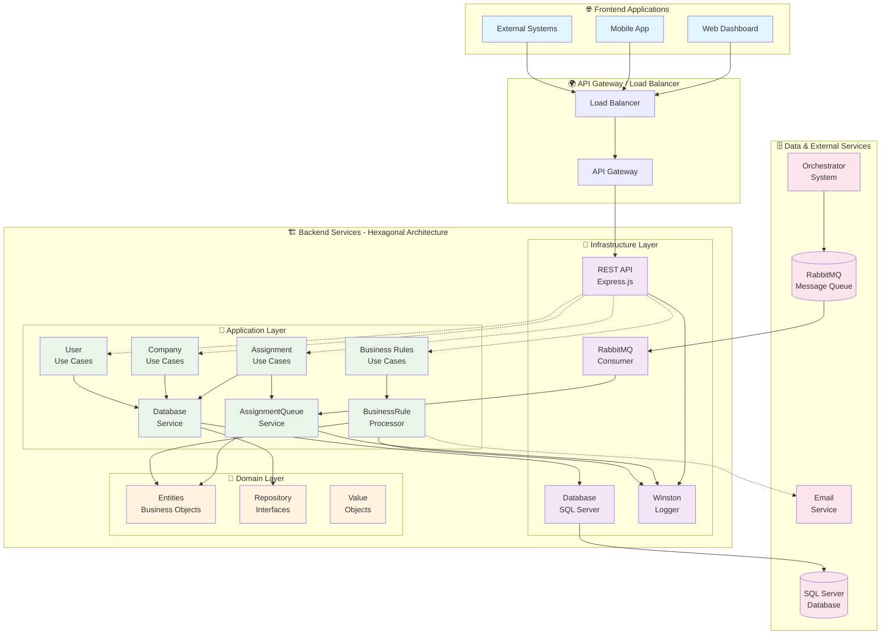
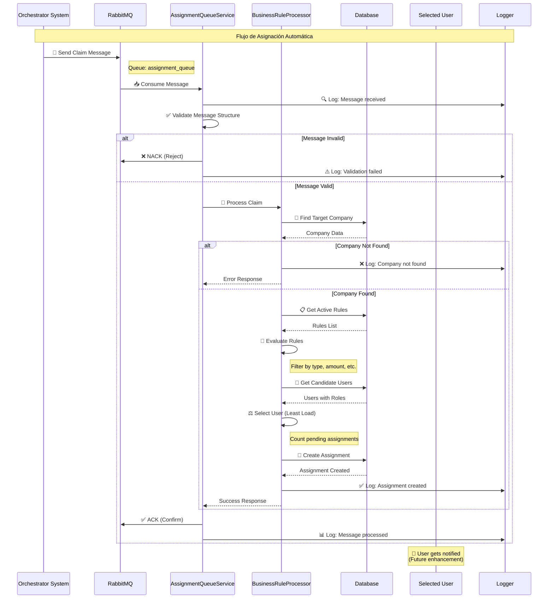
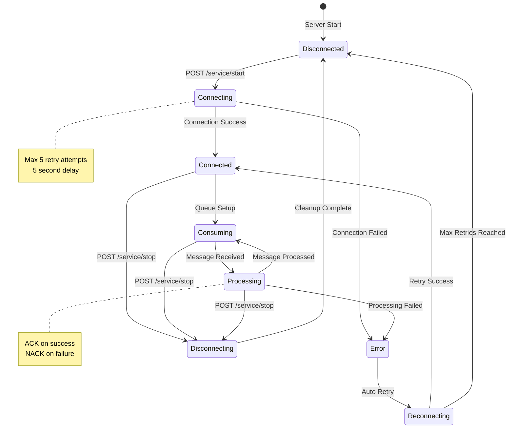
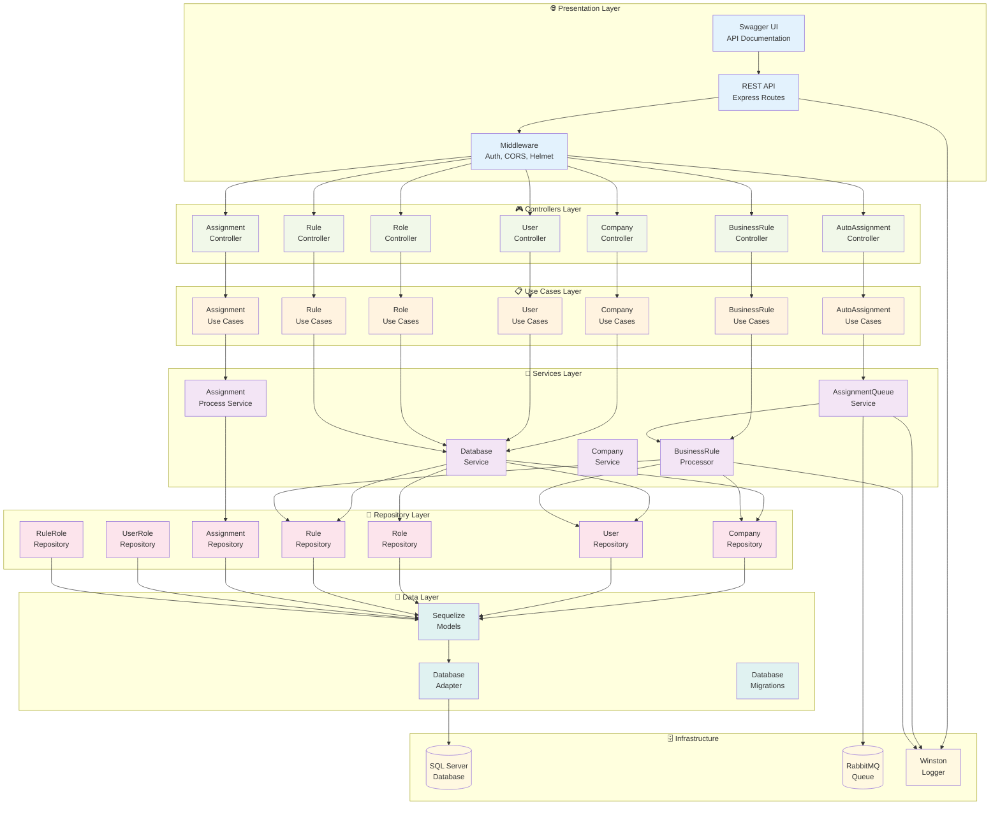
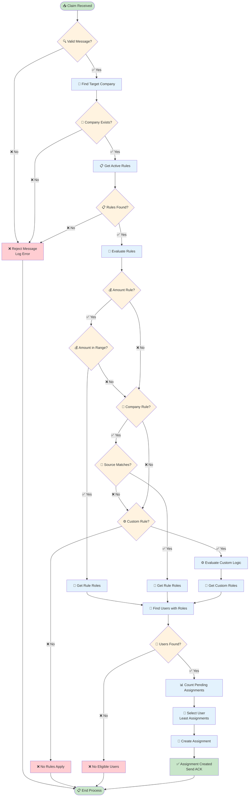
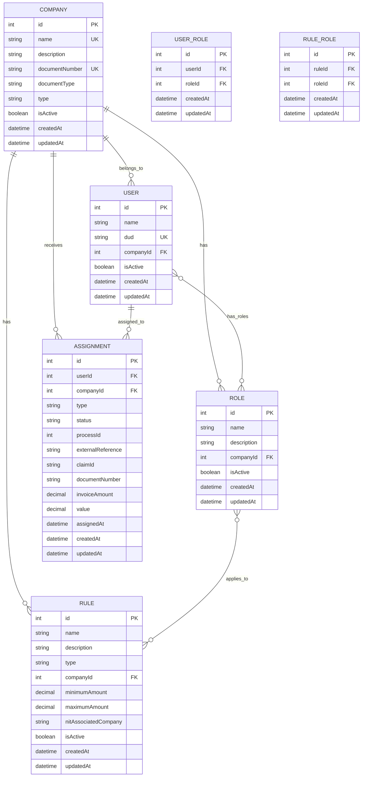
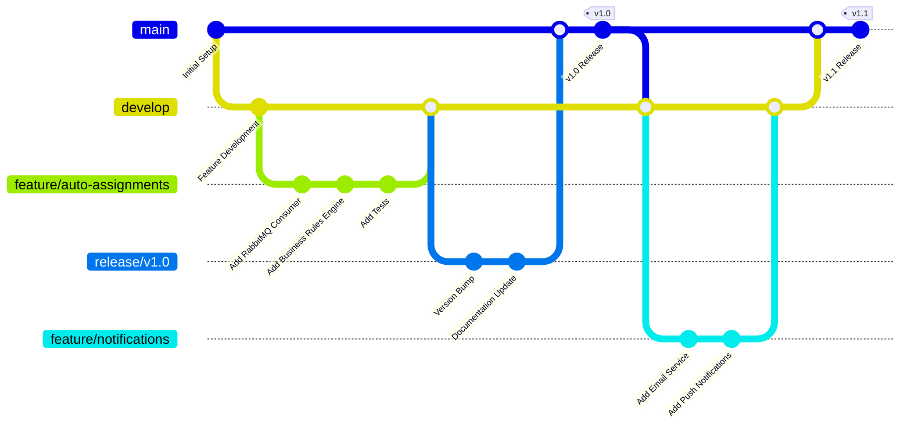

# 🌊 Diagramas de Flujo del Sistema

## 📊 Arquitectura Completa del Sistema

## 🔄 Flujo de Procesamiento de Asignaciones Automáticas

## 🎛️ Flujo de Control Manual del Servicio

## 🏗️ Arquitectura de Componentes por Capas

## 🎯 Flujo de Decisión para Asignaciones

## 📊 Modelo de Datos y Relaciones

## 🚀 Flujo de Despliegue y CI/CD (Futuro)

---

Estos diagramas proporcionan una vista completa del sistema desde diferentes perspectivas: arquitectura, flujo de datos, estados del servicio, estructura de componentes, lógica de decisiones, modelo de datos y proceso de desarrollo.
